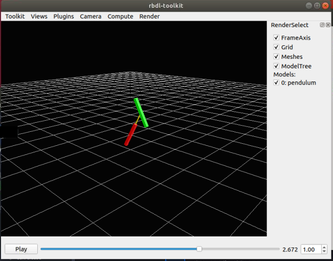
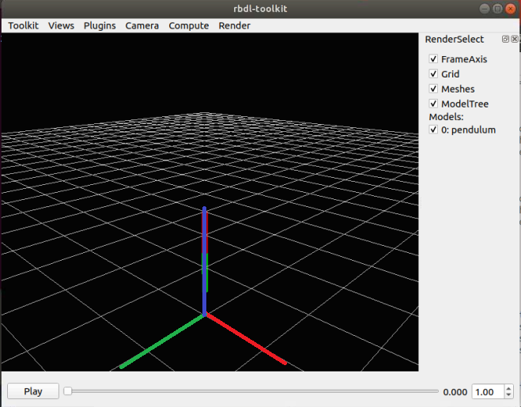
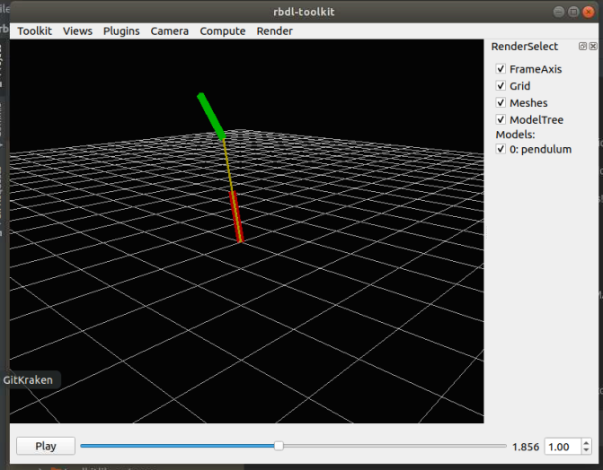

Creating Models
=================

In this wiki I will describe how to create Lua and URDF models. 

## Background

RBDL is capable of working with the following model files: 
- Lua: Lua models are a data structure created in the Lua language. As such, Lua models are simply Lua commands that is evaluated by the Lua compiler and offers strong flexibility. 
- Unified Robot Description Format (URDF): URDF models are XML-based layout commonly used in the Robot Operating System (ROS).  

## Useful functions

The `F5` command in Toolkit reloads all the models, so you can make modifications and quickly see the results instead of needing to reopen the software. 

## Pendulum, kinematics

The first set of example can be found in `./example/pendulum_kinematic`. See below for a breakdown of file. 

### Lua Model, `pendulum.lua`

To load the Lua model and the trajectory file into rbdl-toolkit, the command is `rbdl-toolkit --model pendulum.lua 
--animation pendulum.csv`

```
rod_length = 1
```

Since Lua is a programming language, simple assignment operations can be used to set up variables for use for the rest of the document, allowing for rapid modifications. 

```
meshes = {
  rod1 = {
	color = { 1, 0, 0},
	mesh_center = {0, 0, -rod_length/2},
	dimensions = { 0.2, 0.2, rod_length},
	src = "unit_cube.obj"
  },
  rod2 = {
	color = { 0, 1, 0},
	mesh_center = {0, 0, -rod_length/2},
	dimensions = { 0.1, 0.1, rod_length},
	src = "unit_cube.obj"
  }
}
```

The meshes object denotes how to visualize the model. Regardless of mesh definition, a basic wire-frame will be inserted to denote the mesh. The below code block describes two mesh objects that will later be used in the model itself. 
- `color` denotes the colour of the object in red, green, blue (RGB) order
- `mesh_center` denotes the rotation center of this mesh. If it is set to `{0, 0, 0}`, it will rotate around its centre. 

|  | 
|:--:| 
| Default model from the examples |


|  | 
|:--:| 
| Mesh center set to `{0, 0, 0}`. |

- `dimensions` sets the size of the mesh itself. If it is set to `{0.1, 0.1, 0.1}`, then it will be a 0.1 m cube. 

|  | 
|:--:| 
| Mesh center set to `{ rod_length, 0.1, rod_length}`. |

- `src` denotes the source image file of the mesh. A set of default meshes can be found in `meshes\`

```
model = {
  configuration = {
	axis_right = { -1, 0, 0 },
	axis_front = { 0, -1, 0 },
	axis_up =    { 0, 0, -1 },
  },

  frames = {
	{
	  name = "segment1",
	  parent = "ROOT",
	  visuals = { meshes.rod1 },
	  joint = {{ 0, 1, 0, 0, 0, 0 }},
	  joint_frame = {
		E = {{1, 0, 0}, {0, 1, 0}, {0, 0, 1}}
	  }
	},
	{
	  name = "segment2",
	  parent = "segment1",
	  visuals = { meshes.rod2 },
	  joint = {{ 0, 1, 0, 0, 0, 0 }},
	  joint_frame = {
		r = { 0., 0., -rod_length },
		E = {{1, 0, 0}, {0, 1, 0}, {0, 0, 1}}
	  }
	}
  }
}
```

- `gravity` denotes the direction of gravity with respect to the global frame. This is an important factor when you are using RBDL to calculate joint torque, but not important in this particular instance because the dynamic parameters are not incorporated yet. 
- `configuration` denotes how the global frame is being visualized. *Note that there appears to be some sort of bug where the joint rotations may not respect the global angle direction so `-1` may be needed instead of `1`*. In the default camera view (`Toolkit > Settings > CameraOptions`, position at `<6,3,6>` and view_center at `-4.34917, -1.85781, -4.63835`), then the axis directions are denoted as below:

|  | 
|:--:| 
| `axis_front`, `axis_right`, and `axis_up` denoted as RGB. In the example, this is set to be XYZ. |

- `frames` denote the individual frames that make up the model tree. Each frame require the following elements:
  - `name`, an unique name is required for each frame
  - `parent`, the frame that this frame is attached to. The world frame is named `ROOT`. 
  - `visuals` denotes the mesh that should be loaded. In this example, it refers to the `meshes` object defined earlier. 
  - `joint` denote the axes of rotation, in the order of the local frame rotation XYZ, then translation XYZ. 
    - Multiple joints can be defined by concatination. A 3 DOF XYZ Euler joint would look like ` joint = {{ 1, 0, 0, 0, 0, 0 }, { 0, 1, 0, 0, 0, 0 }, { 0, 0, 1, 0, 0, 0 }}`
  - `joint_frame` denotes the attachment site of the frame with respect to the parent frame. 
    - `r` denotes the translational offset. For `segment1`, no offset is set. For `segment2`, the link starts at `rod_length` away from the parent frame. If unset, this is `{0, 0, 0}`.

|  | 
|:--:| 
| `axis_front`, `axis_right`, and `axis_up` denoted as RGB. In the example, this is set to be XYZ. |

    - `E` denotes the rotation matrix offset from the parent frame. If unset, this is identify `{1, 0, 0}, {0, 1, 0}, {0, 0, 1}`. 
    
|  | 
|:--:| 
| Pendulum animating. |

```
return model
```

Since the Lua model is basically running a code snippet, the model must be returned. 

### URDF Model, `pendulum.urdf`